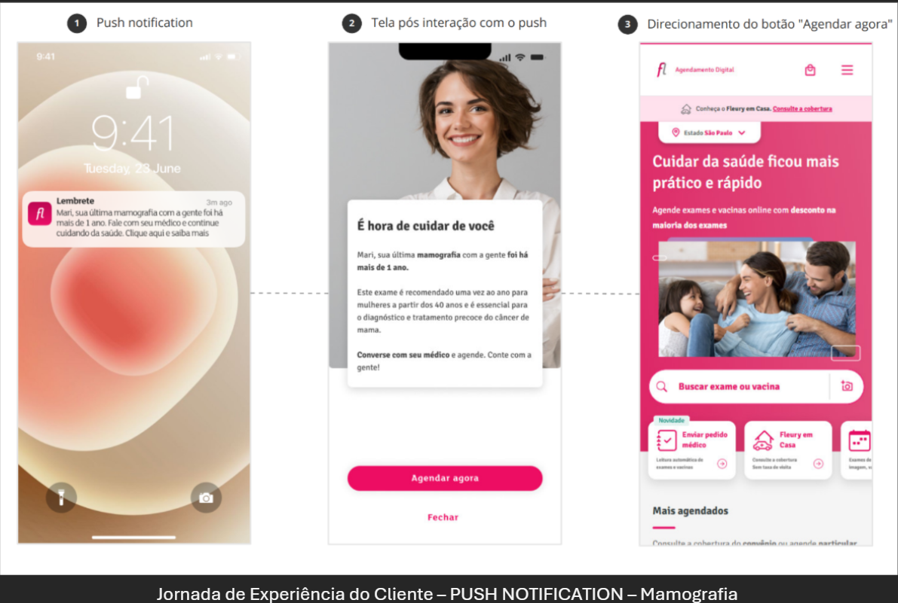
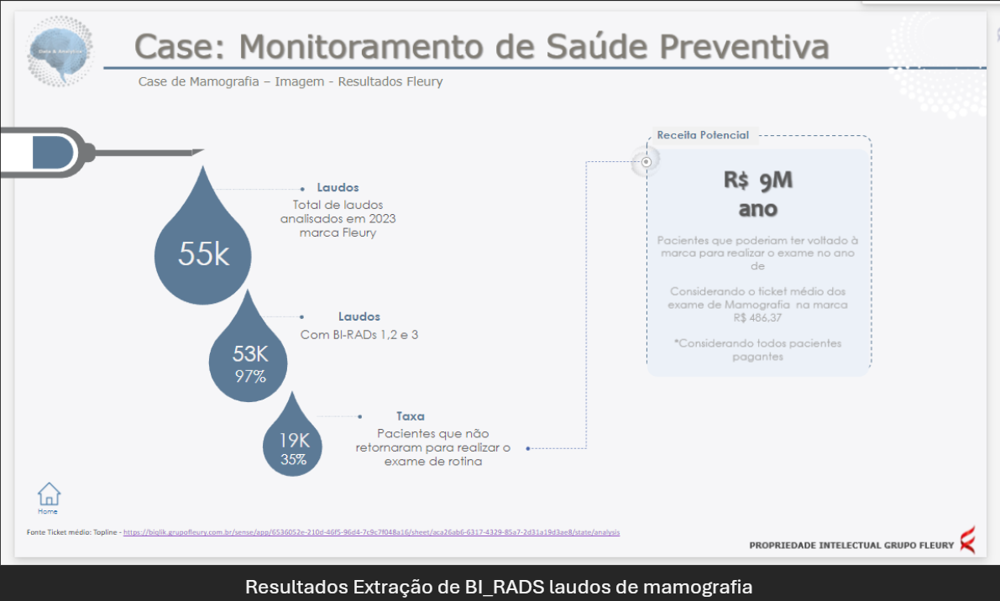
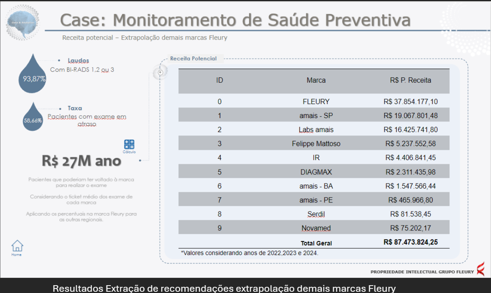
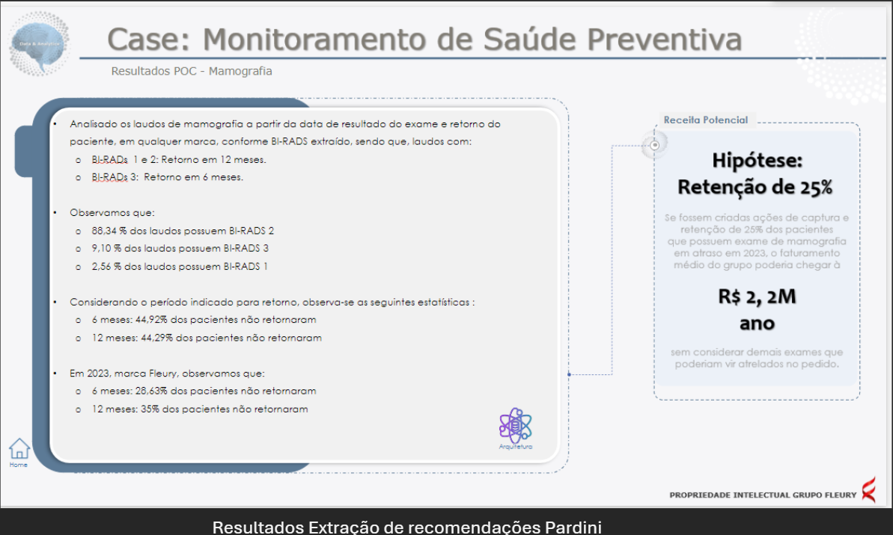
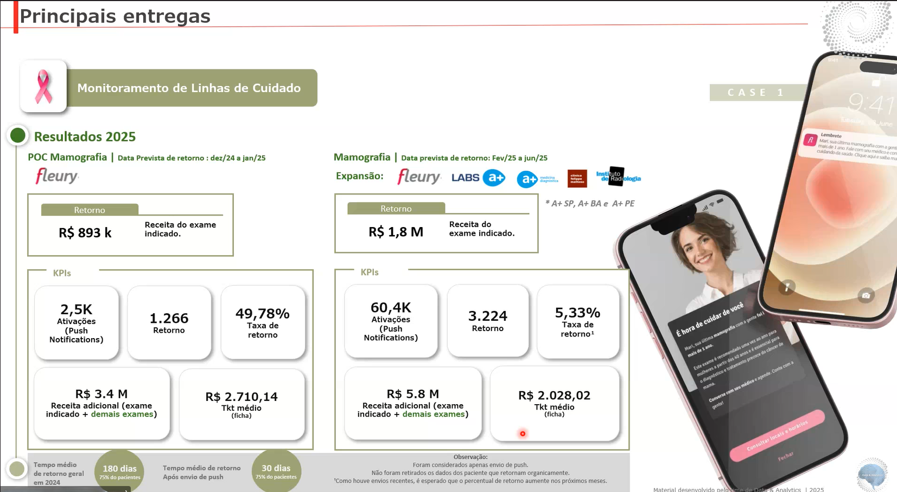

# Monitoramento de Linhas de Cuidado - Case Mama: Inovação que Salva Vidas e Gera Valor

## Transformando a Saúde da Mulher com Inteligência e Cuidado

O câncer de mama é uma das maiores preocupações de saúde global, e a detecção precoce é a chave para o sucesso do tratamento e a preservação da vida. No Grupo Fleury, acreditamos que a tecnologia e a inovação podem revolucionar a forma como cuidamos de nossas pacientes. É com essa visão que apresentamos o projeto **"Monitoramento de Linhas de Cuidado - Case Mama"**, uma iniciativa pioneira que une inteligência artificial, dados e um cuidado humanizado para garantir que nenhuma mulher perca a oportunidade de um diagnóstico e tratamento em tempo hábil.

### O Desafio: Por que este Projeto é Essencial?

A mamografia é um exame vital, mas a jornada de acompanhamento muitas vezes é complexa. Pacientes podem não retornar para exames de rotina ou investigações adicionais, resultando em diagnósticos tardios. Essa lacuna não só afeta a saúde e o bem-estar das pacientes, mas também gera custos significativos para as operadoras de saúde, que arcam com tratamentos mais complexos e onerosos em estágios avançados da doença.

**Nosso compromisso é reverter esse cenário, garantindo que o cuidado seja contínuo, proativo e eficaz.**

### Nossa Solução: Cuidado Inteligente e Conectado

Desenvolvemos uma plataforma inovadora que utiliza a inteligência de dados para monitorar e engajar pacientes de forma personalizada. Através de um sistema inteligente, somos capazes de:

*   **Identificar com Precisão:** Analisamos inúmeros laudos de exames para identificar pacientes que precisam de acompanhamento, especialmente aquelas com exames de mamografia em atraso ou que necessitam de investigações adicionais.
*   **Ativar de Forma Proativa:** Enviamos lembretes e informações importantes diretamente para os médicos poderem acompanhar as jornadas e retornos e também para as pacientes, através de canais como o aplicativo Fleury e campanhas de marketing personalizadas. Isso garante que elas sejam lembradas da importância de seus exames e do cuidado contínuo.
*   **Simplificar a Jornada:** Facilitamos o acesso à informação e ao agendamento, tornando a experiência da paciente mais fluida e menos burocrática.
*   **Apoiar a Decisão Médica:** Fornecemos aos médicos e equipes de saúde um panorama completo da jornada da paciente, com dados estruturados e insights que apoiam decisões clínicas mais rápidas e assertivas.

### Resultados que Fazem a Diferença: Impacto Real e Valor Gerado

Este projeto não é apenas uma promessa; ele já entrega resultados tangíveis e demonstra um potencial de valor significativo:

*   **Melhora na Adesão ao Cuidado:** Nossos dados iniciais mostram que uma parcela considerável de pacientes não retorna para exames de rotina. Com ações de engajamento, podemos reverter essa tendência.
*   **35% das pacientes da marca Fleury que realizaram o exame em 2023 estão com mamografia em atraso.**
*   **44,92% das pacientes com recomendação de retorno em 6 meses não retornaram.**
*   **44,29% das pacientes com recomendação de retorno em 12 meses não retornaram.**

*   **Potencial de Retenção e Receita:** Ao engajar proativamente as pacientes, geramos um impacto financeiro positivo e sustentável.
*   **Apenas com a marca Fleury, a retenção de 25% das pacientes em atraso em 2023 poderia gerar um faturamento médio de R$ 2,2 Milhões por ano.**
*   **Considerando todas as marcas do Grupo Fleury (Fleury, Felippe Mattoso, Labs a+ , IR, DIAGMAX, Serdil, Novamed), o potencial de receita anual com a recuperação de pacientes em atraso pode chegar a impressionantes R$ 87,4 Milhões.**

*   **Experiência do Paciente Aprimorada:** A jornada de notificação via aplicativo é um exemplo de como tornamos o cuidado mais acessível e conveniente, lembrando a paciente de forma gentil e direcionando-a para o agendamento.

### Entregas do Projeto

### Nosso Compromisso com o Futuro da Saúde

O projeto "Monitoramento de Linhas de Cuidado - Case Mama" é um testemunho do compromisso do Grupo Fleury com a inovação e a excelência em saúde. Ao alavancar o poder dos dados e da inteligência artificial, estamos construindo um futuro onde o cuidado preventivo é mais inteligente, acessível e, acima de tudo, mais eficaz na proteção da vida.

**Junte-se a nós nesta jornada para transformar a saúde da mulher e gerar valor para toda a cadeia de saúde.**