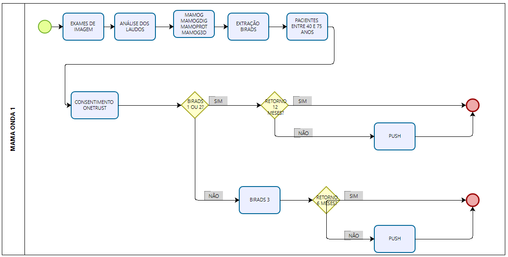
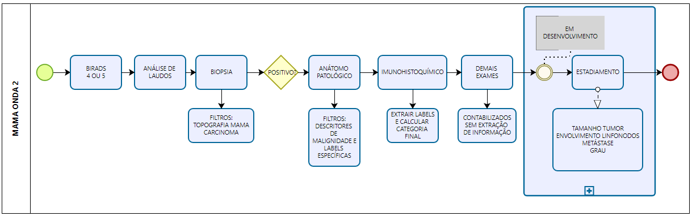
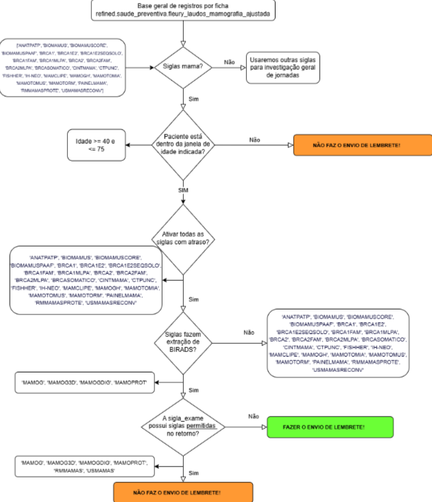

# Monitoramento de Linhas de Cuidado - Case Mama

## Visão Geral do Projeto: Plataforma de Saúde Preditiva e Gestão de Jornada

O projeto "Monitoramento de Linhas de Cuidado - Case Mama" é uma iniciativa estratégica de **aceleração digital** e **saúde preventiva**, concebida como uma colaboração multidisciplinar entre a DTI e as equipes de Data & Analytics do Grupo Fleury. Nosso objetivo é construir uma **plataforma de dados e inteligência artificial** robusta para otimizar a jornada de rastreamento, diagnóstico e acompanhamento do câncer de mama, transformando dados brutos em insights acionáveis para a gestão clínica e operacional.

### O Desafio: Fragmentação de Dados e Otimização de Fluxos Clínicos

O rastreamento do câncer de mama, centrado na mamografia, enfrenta desafios significativos na **adesão do paciente** a recomendações de retorno e investigações adicionais. A ausência de um **sistema unificado de notificação e acompanhamento** resulta em jornadas fragmentadas, elevando o risco de diagnósticos tardios e impactando negativamente o prognóstico do paciente. Do ponto de vista técnico e de negócio, essa lacuna se traduz em:

*   **Perda de Oportunidade de Intervenção Precoce:** Dificuldade em identificar e engajar pacientes que necessitam de follow-up.
*   **Custos Operacionais Elevados:** Tratamentos em estágios avançados são inerentemente mais caros e complexos para as operadoras de saúde.
*   **Subutilização de Dados Clínicos:** Laudos e resultados de exames contêm informações críticas que, se não estruturadas e analisadas, permanecem como dados "dark" ou subaproveitados.

### Arquitetura e Objetivos Técnicos

Para mitigar esses desafios, o projeto propõe a construção de um **data lake/warehouse** unificado, consolidando dados heterogêneos de diversas fontes (SAD, LIS, etc.) do Grupo Fleury e Pardini. A arquitetura visa:

1.  **Ingestão e Harmonização de Dados:**
    *   Consolidar exames de imagem (mamografia, tomossíntese, ultrassom, RM), biópsias mamárias, resultados anatomopatológicos e imunohistoquímicos, e exames genéticos.
    *   Tratar dados semi-estruturados e não-estruturados (e.g., laudos médicos) para extração de entidades e atributos relevantes.

2.  **Processamento e Enriquecimento de Dados (Feature Engineering):**
    *   **Extração de BI-RADS:** Implementação de regras de Regex para identificar e padronizar escores BI-RADS (0 a 6) a partir de laudos textuais.
    *   **Processamento de Linguagem Natural (NLP) e LLMs:** Utilização de modelos de linguagem para extrair descritores de malignidade, padrões de densidade mamária, tipos e tamanhos de lesões, localização e outros labels histopatológicos (Grau Histológico, Grau Nuclear, Formação de Túbulos, Índice Mitótico, Tipos Histológicos de Carcinoma).
    *   **Normalização e Categorização:** Padronização de termos e categorização de resultados (e.g., status de receptores hormonais, HER-2, Ki-67).

3.  **Modelagem Preditiva e Prescritiva:**
    *   **Identificação de Pacientes em Risco:** Desenvolvimento de modelos para calcular o percentual de pacientes com exames em atraso.
    *   **Estadiamento Automatizado (TNM):** Implementação de lógica baseada em IA para inferir o estadiamento do tumor (T, N, M e Estágio 0-IV) a partir de múltiplos atributos clínicos e patológicos.

4.  **Integração e Consumo de Dados:**
    *   Criação de **dashboards clínicos** para consumo por equipes médicas e de gestão, permitindo filtros avançados e visualização de linhas do tempo evolutivas.
    *   Integração com plataformas de **marketing (CRM)** e **aplicativos móveis (Push Notifications)** para ativação e engajamento de pacientes.

### Fases do Projeto (Onda 1 e Onda 2)

O projeto é estruturado em fases incrementais:

*   **Onda 1 (POC/MVP Inicial):** Foco na extração de BI-RADS de exames de imagem, identificação de pacientes em atraso e ativação via canais de comunicação. Esta fase estabelece a base de dados e os primeiros mecanismos de engajamento.
*   **Onda 2 (Expansão):** Aprofundamento da análise com a inclusão de dados de biópsias, anatomopatológicos, imunohistoquímicos e genéticos. Esta fase visa a extração de labels complexos, o cálculo de categorias finais (e.g., Luminal A/B, HER2 Superexpresso, Triplo Negativo) e o desenvolvimento do módulo de estadiamento do tumor, fornecendo uma visão 360º para a coordenação do cuidado.

Este projeto não apenas visa melhorar os resultados clínicos e a experiência do paciente, mas também aprimorar a capacidade analítica e operacional do Grupo Fleury, transformando a gestão da saúde preventiva através de uma abordagem data-driven e impulsionada por IA.

# Monitoramento de Linhas de Cuidado - Case Mama - Onda 1: Detalhamento do Fluxo Inicial

## Introdução
Este documento detalha o fluxo inicial do processo de monitoramento de linhas de cuidado para câncer de mama, focado na "Onda 1" do projeto. Ele abrange desde a entrada dos exames de imagem até a notificação de pacientes com base nos resultados de BI-RADS e regras de retorno.

## Fluxo de Processo Detalhado (Onda 1)

### 1. Exames de Imagem (Entrada)
O processo se inicia com a entrada de dados provenientes de exames de imagem mamários.

*   **MAMOG:** Mamografia
*   **MAMOGDIG:** Mamografia, digital
*   **MAMOPROT:** Mamografia, em pacientes com prótese mamária
*   **MAMOG3D:** Mamografia 3D, tomossíntese

### 2. Extração do BI-RADS (Regex 0 a 6)
Nesta etapa, é realizada a extração do escore BI-RADS dos laudos dos exames de imagem.

**Observações para Extração do BI-RADS:**
*   Coletar a última menção da palavra "BI-RADS" no corpo do laudo.
*   Procurar o primeiro algarismo numérico em até 5 caracteres antes ou até 15 caracteres à frente de "BI-RADS".

### 3. Extração de Outros Labels via LLM
Um modelo de Linguagem Grande (LLM) é utilizado para extrair informações adicionais e estruturadas dos laudos, complementando a análise.

**Labels a serem extraídos via LLM:**
*   Padrão de densidade mamária (4 categorias)
*   Tipo da lesão índice (a lesão responsável pelo BI-RADS 3, 4 ou 5): nódulo/massa, microcalcificações, etc.
*   Tamanho da lesão índice (aplicável a nódulos ou massas)
*   Localização da lesão índice (qual mama e quadrante)
*   Descritores das lesões baseados no léxico BI-RADS
*   Indicação do exame: rastreamento, estadiamento, mamografia diagnóstica etc.

### 4. Tabela de Exames (Modelo 1)
A seguir, a tabela de referência para os exames considerados na Onda 1, incluindo suas siglas, mnemônicos Pardini e descrições:

| **Sigla/MN**    | **Mnemônico Pardini** | **DescExm - Pardini**   |
| :-------------- | :---------------- | :-------------------------- |
| USMAMAS         | USMAX             | US MAMA E AXILA             |
| MAMOGDIG        | MAMODI            | MAMOGRAFIA DIGITAL          |
| MAMOG           | MAMO              | MAMOGRAFIA                  |
| RMMAMAS         | RMMAMO            | RM DE MAMA                  |
| MAMOPROT        | * sem mnemônico   | sem correlação              |
| USMAMASD        | USMADC            | US DAS MAMAS COM DOPPLER COLORIDO |
| RMMAMASPROTE    | * sem mnemônico   | sem correlação              |
| MAMOGH          | * sem mnemônico   | sem correlação              |
| MAMOG3D         | * sem mnemônico   | sem correlação              |
| USMAMASRECONV   | USMA              | US DA MAMA                  |

### 5. BI-RADS 1, 2, 3: Regras para Notificação
Para pacientes com BI-RADS 1, 2 ou 3, são verificadas regras específicas para notificação e acompanhamento.

#### 5.1. Regras de Ativação e Lembrete
*   **Ativação:** Pacientes entre 40 e 75 anos, com consentimento registrado no OneTrust.
*   **Lembretes:**
*   **BI-RADS 1 e 2:** Lembrete de retorno em 12 meses.
*   **BI-RADS 3:** Lembrete de retorno em 6 meses.

#### 5.2. Critério de Retorno da Paciente
Considera-se que a paciente retornou se a ficha de retorno contiver um dos seguintes exames:
*   MAMOG
*   MAMOG3D
*   MAMOGDIG
*   MAMOPROT
*   USMAMAS
*   USMAMASD
*   RMMAMAS

### 6. Canais de Ativação e Alinhamento

#### 6.1. Canais de Aplicação (App) e Marketing (MKT)
*   **App:** Fleury, LabsA+ e A+ SP
*   **MKT:** Fleury + outras marcas (excluindo Pardini)

#### 6.2. Alinhamento de Fluxo de Envios
*   É necessário alinhar com a equipe de Marketing (MKT) o fluxo de envios para pacientes Pardini (com a Dra. Junia ou conforme indicação).

# Monitoramento de Linhas de Cuidado - Case Mama - Onda 2: Detalhamento das Novas Etapas

## Introdução
Este documento detalha as novas etapas do processo de monitoramento de linhas de cuidado para câncer de mama, que se estendem a partir da classificação inicial dos exames de imagem (BI-RADS 1, 2, 3). O objetivo é aprofundar a investigação e o acompanhamento de casos que requerem atenção adicional, incluindo biópsias, exames anatomopatológicos, imunohistoquímicos e genéticos, culminando no estadiamento do tumor.

## Fluxo de Processo Detalhado Onda 2

### 1. Classificação BI-RADS 1, 2, 3 (Ponto de Partida)
Após a extração e classificação dos BI-RADS dos laudos de mamografia (conforme detalhado na documentação inicial do projeto), o fluxo se ramifica para as seguintes ações, dependendo da necessidade de investigação adicional.

### 2. BI-RADS 4 e 5: Necessidade de Biópsia

Para pacientes com classificação BI-RADS 4 e 5, no retorno é necessário analisar a biópsia.
Filtrar termo "**topografia: MAMA**". Para os laudos de mama filtrar a palavra "**CARCINOMA**" e extrair toda a frase que está associada ao termo.

#### 2.1. Exames (Modelo 2 ou RegEx)
Os seguintes exames de biópsia são considerados nesta etapa:

| Sigla/MN        | Mnemônico Pardini | DescExm - Pardini                                |
| :-------------- | :---------------- | :----------------------------------------------- |
| BIOMAMUSCORE    | USPCOB            | PUNCAO POR AGULHA GROSSA DAS MAMAS               |
| BIOMAMUSPAAF    | CBGEST            | CORE BIOPSY DE MAMA (GUIADA POR ESTEREOTAXIA)    |
| BIOMAMUS        | USPAFI            | US MAMAS AGULHA FINA PUNCAO                      |
| MAMOTOMIA       | ESMATO            | MAMOTOMIA POR ESTEREOTAXIA                       |
| MAMOTOMUS       | USMATO            | MAMOTOMIA POR ECOGRAFIA                          |
| MAMCLIPE        | MPFECG            | MARCAÇÃO PRÉ-CIRUR. POR FIO METÁLICO POR ECOGRAFIA |
| MAMOTORM        | RMMATO            | MAMOTOMIA GUIADA POR RM                          |

### 3. Em Casos de Biópsia Positiva: Análise Anatomopatológica

Se a biópsia positiva, o processo avança para a analisar ANATOMOPATOLÓGICO.

#### 3.1. Descritores de Malignidade
Na análise dos laudos, serão buscados os seguintes termos para identificar malignidade:
*   carcinoma 
*   invasivo
*   invasor
*   sarcoma
*   metástase
*   metastático
*   maligno
*   maligna
*   cdi, cli, cdis

#### 3.2. Outros Labels
Outros labels a serem extraídos dos laudos anatomopatológicos incluem:

- **Grau histológico**: será sempre um algarismo 1, 2 ou 3 (apenas três categorias). Ou seja, para achar, bastar procurar o primeiro algarismo numérico depois do termo "grau histológico".

- **Grau nuclear**: será sempre um algarismo 1, 2 ou 3 (apenas três categorias). Ou seja, para achar, bastar procurar o primeiro algarismo numérico depois do termo "grau nuclear".

- **Formação de túbulos**: será sempre um algarismo 1, 2 ou 3 (apenas três categorias). Ou seja, para achar, bastar procurar o primeiro algarismo numérico depois do termo "Formação de túbulos"

- **Índice mitótico**: será sempre um algarismo 1, 2 ou 3 (apenas três categorias). Ou seja, para achar, bastar procurar o primeiro algarismo numérico depois do termo "mm2". Nesse caso, é melhor procurar o termo "mm2" ao invés do "índice mitótico".

- **Labels de tipos histológicos**: 
    - Carcinoma de mama ductal invasivo (CDI)/SOE 
    - Carcinoma de mama ductal in situ 
    - Carcinoma de mama lobular invasivo 
    - Carcinoma de mama lobular 
    - Carcinoma de mama papilífero 
    - Carcinoma de mama metaplásico 
    - Carcinoma de mama mucinoso 
    - Carcinoma de mama tubular 
    - Carcinoma de mama cístico adenoide 
    - Carcinoma de mama medular 
    - Carcinoma de mama micropapilar 
    - Carcinoma de mama misto (ductal e lobular) invasivo

#### 3.3. Exames (Modelo 3)
Os exames anatomopatológicos considerados nesta etapa incluem:

| Sigla/MN | Mnemônico Pardini | DescExm - Pardini                         |
| :------- | :---------------- | :---------------------------------------- |
| ANATPATP | MICROH            | MICRO-HISTOLOGIA (BIÓPSIA ECOENDOSCOPIA) |
| CTPUNC   | MICROH            | MICRO-HISTOLOGIA (BIÓPSIA ECOENDOSCOPIA) |
| FISHHER  | FPAH              | FISH - PESQUISA DE AMPLIFICAÇÃO DE HER-2  |

### 4. Análise Imunohistoquímica

Junto com o anatomopatológico, comumente é feito o exame IMUNOHISTOQUÍMICO.

#### 4.1. Exames Imunohistoquímicos (Modelo 4)
Os exames imunohistoquímicos considerados nesta etapa incluem:

| Sigla/MN | Mnemônico Pardini | DescExm - Pardini                         |
| :------- | :---------------- | :---------------------------------------- |
| IH-NEO   | IHMAMA            | PAINEL IMUNOHISTOQUÍMICO PARA MAMA (APC) |
| IH-MAMA  | IHMAMA            | PAINEL IMUNOHISTOQUÍMICO PARA MAMA (APC) |

#### 4.2. Extração de Labels Estruturados da Imunohistoquímica
Serão extraídos os seguintes labels estruturados dos laudos de imunohistoquímica:

*   **Receptor de Estrogênio (categórica):** POSITIVO ou NEGATIVO
    *   Serão buscadas as frases:
         - "RECEPTOR DE ESTRÓGENO - POSITIVO"
         - "RECEPTOR DE ESTRÓGENO - NEGATIVO".

*   **Receptor de Progesterona (categórica):** POSITIVO ou NEGATIVO
    *   Serão buscadas as frases:
        *   "RECEPTOR DE PROGESTERONA - POSITIVO" 
        *   "RECEPTOR DE PROGESTERONA - NEGATIVO".

*   **Status do HER-2 (categórica):** Negativo, inconclusivo ou positivo
    *   Serão buscadas as frases e interpretados os escores:
        *   "HER-2 - ESCORE 0" = Negativo
        *   "HER-2 - ESCORE 1+" = Negativo
        *   "HER-2 - ESCORE 2+" = Inconclusivo
        *   "HER-2 - ESCORE 3+" = Positivo

*   **Porcentagem do Ki-67 (numérica):**
    *   Deve ser extraído o número da porcentagem presente na frase "KI-67 - POSITIVO EM XX% DAS CÉLULAS NEOPLÁSICAS".

*   **Status CK5/6 (categórica):** POSITIVO ou NEGATIVO
    *   Serão buscadas as frases: 
        *   "CK5/6 - POSITIVO" 
        *   "CK5/6 - NEGATIVO".

#### 4.3. Extração ou cálculo da categoria final
A Extração da categoria final deve obedecer as seguintes regras:

*   **Luminal A**
    *   (Receptor de Estrogênio E/OU Receptor de Progesterona POSITIVO) E (HER-2 NEGATIVO) E (KI-67<14%)

*   **Luminal B**
    *   (Receptor de Estrogênio E/OU Receptor de Progesterona POSITIVO) E (HER-2 NEGATIVO) E (KI-67>14%)

*   **Luminal com HER2 Positivo**
    *   (Receptor de Estrogênio E/OU Receptor de Progesterona POSITIVO) E (HER-2 POSITIVO) E (KI-67 Qualquer)

*   **HER-2 Superexpresso**
    *   (Receptor de Estrogênio E Receptor de Progesterona NEGATIVO) E (HER-2 POSITIVO) E (KI-67 Qualquer)

*   **Triplo Negativo**
    *   (Receptor de Estrogênio E Receptor de Progesterona NEGATIVO) E (HER-2 NEGATIVO) E (KI-67 Qualquer)

### 5. Demais Exames Complementares (Genéticos e Outros)

Os demais exames complementares são contabilizados (GENÉTICOS e SEM INFORMAÇÃO), mas **não são extraídas informações de seus laudos** para esta etapa do processo.

#### 5.1. Lista de Demais Exames Complementares

| Sigla/MN         | Mnemônico Pardini | DescExm - Pardini                                    |
| :--------------- | :---------------- | :--------------------------------------------------- |
| PAINELMAMA       | P-CH16            | PAINEL PARA CÂNCER DE MAMA E OVÁRIO HEREDITÁRIOS     |
| BRCA1E2          | BRICASQ           | BRCA1 E BRCA2 - SEQUENCIAMENTO GÊNICO COMPLETO       |
| BRCA1E2SEQSOLO   | BRCAS1            | BRCA1 E BRCA2 - SEQUENCIAMENTO GENICO COMPLETO       |
| BRCA2MLPA        | P-BRCA            | BRCA1 E BRCA2, PAINEL - SEQUENCIAMENTO E MLPA        |
| BRCA1MLPA        | P-BRCA            | BRCA1 E BRCA2, PAINEL - SEQUENCIAMENTO E MLPA        |
| BRCA1FAM         | BRCA1M            | BRCA1 - MUTAÇÃO FAMILIAR                             |
| BRCA2FAM         | P-CH16            | PAINEL PARA CÂNCER DE MAMA E OVÁRIO HEREDITÁRIOS     |
| BRCA1            | BRCAS1            | BRCA1 E BRCA2 - SEQUENCIAMENTO GENICO COMPLETO       |
| BRCA2            | BRCAS2            | BRCA1 E BRCA2 - SEQUENCIAMENTO GENICO COMPLETO       |
| BRCASOMATICO     | BRCA-T            | SEQUENCIAMENTO BRCA1 E BRCA2 EM AMOSTRA DE TUMOR     |
| BRCAASHK         | JUDASH            | PAINEL GENÉTICO JUDEU ASHKENAZI                      |
| AKCRMMAMAS       | * sem mnemônico   | sem correlação                                       |
| CINTMAMA         | CIMAMA            | CINTILOGRAFIA DE MAMA (BILATERAL)                    |
| DUCTOG           | RXDUCT            | DUCTOGRAFIA                                          |

### 6. Estadiamento (TNM)

Após a coleta e análise das informações dos exames anteriores, o processo culmina no estadiamento do tumor.

#### 6.1. Desenvolvimento de IA para Cálculo do Estadiamento
Será desenvolvida uma Inteligência Artificial (IA) para calcular o estadiamento do tumor (TNM), utilizando os seguintes parâmetros:

*   **T (Tamanho do tumor):** Avaliação do tamanho do tumor primário.
*   **N (Envolvimento de linfonodos):** Avaliação da presença e extensão do câncer nos linfonodos regionais.
*   **M (Metástase à distância):** Avaliação da presença de metástase em órgãos distantes.

#### 6.2. Estágios do Câncer
O estadiamento resultará na classificação do câncer em um dos seguintes estágios:
*   Estágio 0
*   Estágio I
*   Estágio II
*   Estágio III
*   Estágio IV

## Fluxo com siglas

